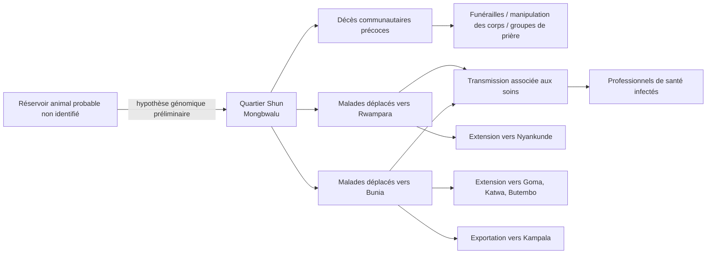

# Retracer le démarrage et la diffusion précoce de l’épidémie récente d’Ebola du 24 avril au 20 mai 2026

## Résumé exécutif

Entre le 24 avril et le 20 mai 2026, l’épidémie d’Ebola due au virus Bundibugyo a évolué d’un signal clinique local mal caractérisé en Ituri vers une urgence internationale reconnue par l’OMS. La séquence la plus robuste, d’après les documents officiels, est la suivante : début connu des symptômes le 24 avril chez un soignant ensuite décédé à Bunia ; premier signal capté à Mongbwalu le 5 mai ; notification officielle de l’alerte le 8 mai ; investigations intensifiées du 11 au 14 mai ; confirmation virologique du Bundibugyo le 15 mai ; puis déclaration d’USPPI par l’OMS le 16 mai, rendue publique le 17 mai. Cette chronologie implique un délai minimal de 21 jours entre le premier début connu et la confirmation officielle, et de 11 jours entre ce début connu et le premier signal d’alerte. citeturn5view0turn9view0turn16view0turn30view0

Le foyer initial le plus probable se situe à Mongbwalu, plus précisément dans le quartier Shun, en zone minière très mobile. Les sources officielles convergent pour indiquer que des malades se sont ensuite déplacés vers Rwampara puis Bunia pour chercher des soins, ce qui a facilité une transmission associée aux soins et une diffusion urbaine. À cela s’ajoutent des décès communautaires, des pratiques funéraires à risque et des groupes de prière collectifs signalés dans les documents de terrain. L’exportation internationale est devenue avérée avec deux cas importés à Kampala les 15 et 16 mai, sans transmission locale documentée en Ouganda dans les sources consultées jusqu’au 20 mai. citeturn5view0turn16view0turn18view0turn30view0

L’ampleur chiffrée a changé très vite — et parfois de manière incohérente selon les institutions. Le 15 mai, la RDC déclarait 8 cas positifs parmi 13 échantillons analysés, 246 cas suspects et 80 décès. Le 19 mai, l’OMS parlait déjà de 30 cas confirmés en RDC, de plus de 500 cas suspects et de 130 décès suspects. Le 20 mai, l’INSP de RDC publiait un projet de situation avec 51 cas confirmés, 575 cas suspects, 148 décès suspects et 847 contacts listés ; le même jour, le Directeur général de l’OMS évoquait 51 cas confirmés en RDC, près de 600 cas suspects et 139 décès suspects. Cette divergence n’invalide pas l’événement ; elle montre plutôt une harmonisation encore inachevée des définitions, des listes de cas et des résultats de laboratoire pendant une phase de rattrapage diagnostique. citeturn9view0turn26view0turn18view0turn19view2

La riposte a été rapide mais contrainte : activation du COUSP en RDC, déploiement d’équipes d’intervention rapide, isolement, triage, décontamination, surveillance aux points d’entrée, mobilisation communautaire, coordination transfrontalière, soutien OMS et Africa CDC, puis déclaration d’une urgence continentale par Africa CDC. Cependant, le contexte de conflit, les déplacements de population, la forte mobilité minière, les lacunes de prévention et contrôle de l’infection, l’absence de vaccin homologué contre Bundibugyo et les contraintes logistiques d’accès à Mongbwalu ont fortement réduit la vitesse de maîtrise. Aucun taux d’attaque ni R effectif n’avait été publié dans les sources officielles examinées au 20 mai. citeturn9view1turn21view0turn37view0turn26view0turn28search0turn28search11

## Cadre analytique et sources

Ce rapport privilégie les sources primaires et quasi primaires : déclaration ministérielle de la RDC du 15 mai ; rapports de situation de l’INSP/COUSP-RDC ; Disease Outbreak News et déclarations de l’OMS ; communications d’Africa CDC ; et communications institutionnelles de la Présidence de la RDC. Pour compléter les angles non couverts en temps réel — en particulier certains détails sur l’Ouganda, la logistique et la couverture médiatique — j’ai utilisé Reuters, AP, The Guardian, MSF et le CDC américain, en signalant explicitement les points où les décomptes divergent. citeturn9view0turn18view0turn30view0turn37view0turn6view0turn32view1

Une limite importante doit être posée d’emblée : le site du ministère ougandais de la Santé était inaccessible au moment de la consultation, ce qui empêche de s’appuyer directement sur son communiqué original. Les informations ougandaises retenues ici ont donc été recoupées via l’OMS, Africa CDC et des médias de référence qui citaient le ministère. Par ailleurs, certains rapports congolais étaient explicitement signalés comme des brouillons ou des documents susceptibles d’être harmonisés ; ils sont donc précieux pour la dynamique du terrain, mais moins stables que les communiqués politiques finaux. citeturn12view0turn5view0turn33view0turn18view0

## Chronologie documentée

Le tableau ci-dessous synthétise les étapes les mieux documentées entre le 24 avril et le 20 mai 2026.

| Date | Événement | Données clés et interventions |
|---|---|---|
| 24/04 | Premier début connu des symptômes | Un soignant — décrit par les autorités congolaises comme un infirmier ou travailleur de santé — présente fièvre, hémorragies, vomissements et malaise intense ; il décède ensuite dans un centre médical à Bunia. Les sources officielles ne permettent pas encore d’affirmer qu’il s’agit du véritable cas index zoologique, mais c’est le premier cas humain actuellement connu. citeturn5view0turn9view0 |
| 05/05 | Premier signal d’alerte | Le COUSP/INSP capte un signal de décès groupés d’étiologie inconnue à Mongbwalu ; l’OMS reçoit aussi une alerte sur une “unknown illness” à forte mortalité dans cette zone, avec décès de soignants. citeturn5view0turn16view0 |
| 08/05 | Notification officielle de l’alerte | Les autorités congolaises notent une notification officielle après rumeurs et signalements de décès groupés, dont environ 50 décès évoqués sur les réseaux sociaux. citeturn16view0 |
| 09–10/05 | Détection humanitaire | MSF indique avoir reçu durant ce week-end des alertes sur une fièvre hémorragique présumée à Mongbwalu ; une équipe évalue la situation et relève 55 décès depuis le début d’avril. citeturn27view1 |
| 11/05 | Double tournant opérationnel | En Ituri, une réunion d’urgence provinciale décide le déploiement d’équipes d’intervention rapide vers Mongbwalu et Rwampara. Le même jour, un patient congolais est admis à Kampala dans un hôpital privé, futur premier cas importé confirmé en Ouganda. citeturn18view0turn5view0turn31search1 |
| 12–14/05 | Investigations et laboratoire | Des investigations simultanées sont menées à Mongbwalu et Rwampara ; 20 échantillons sont prélevés à Rwampara et envoyés à Kinshasa après des tests initiaux négatifs pour Ebola Zaïre et plusieurs autres diagnostics différentiels. Le 14 mai, 8 des 13 échantillons analysés à l’INRB sont positifs pour un orthoebolavirus non-Zaïre, ensuite séquencé comme Bundibugyo. citeturn18view0turn41view0 |
| 14/05 | Premier décès documenté à Kampala | Le premier patient importé identifié en Ouganda décède ; le transfert post mortem du corps vers la RDC a lieu le même jour. citeturn5view0turn31search2 |
| 15/05 | Déclarations nationales | Le ministre congolais de la Santé déclare officiellement la 17e épidémie d’Ebola en RDC dans les zones de santé de Rwampara, Mongwalu et Bunia. La RDC annonce 246 cas suspects et 80 décès ; l’Ouganda confirme le même jour un cas importé de Bundibugyo à Kampala. Africa CDC convoque une réunion régionale d’urgence. citeturn9view0turn33view0turn31search1 |
| 16–17/05 | Internationalisation de l’événement | L’OMS détermine le 16 mai que l’événement constitue une urgence de santé publique de portée internationale ; la déclaration est publiée le 17 mai. Un second cas importé, sans lien apparent avec le premier, est confirmé à Kampala. L’OMS recense alors 8 cas confirmés, 246 cas suspects et 80 décès suspects en Ituri, plus 2 cas confirmés à Kampala. citeturn30view0turn5view0 |
| 18–19/05 | Changement d’échelle | Africa CDC déclare une urgence continentale de sécurité sanitaire. Le 19 mai, le Président de la RDC tient une réunion de crise ; six zones passent en surveillance renforcée et 513 cas suspects sont signalés dans les provinces de l’Ituri et du Nord-Kivu. Le même jour, le Directeur général de l’OMS annonce 30 cas confirmés en RDC, plus de 500 cas suspects et 130 décès suspects. citeturn37view0turn6view0turn26view0 |
| 20/05 | Point de situation consolidé mais encore instable | L’INSP publie un SitRep daté du 20 mai avec 51 cas confirmés, 575 cas suspects, 148 décès suspects et 847 contacts listés, dans 4 zones d’Ituri et 3 zones du Nord-Kivu. Le Directeur général de l’OMS parle le même jour de 51 cas confirmés en RDC, près de 600 cas suspects et 139 décès suspects, avec 2 cas confirmés en Ouganda. citeturn18view0turn19view2 |

La courbe ci-dessous résume les principaux jalons chiffrés officiels en RDC. Pour le 19 mai, la valeur “500” représente un **plancher** correspondant à l’expression utilisée par l’OMS (“more than 500 suspected cases”). citeturn9view0turn26view0turn18view0

*Graphique construit à partir des points de situation officiels de la RDC/INSP et de l’OMS publiés les 15, 19 et 20 mai 2026.* citeturn9view0turn26view0turn18view0

## Propagation géographique et chaînes de transmission

Les documents officiels convergent vers une origine opérationnelle à Mongbwalu, dans le territoire de Djugu en Ituri, et plus précisément dans le quartier Shun selon les SitReps de l’INSP. L’OMS estime que l’événement “originated in the Mongbwalu HZ”, zone minière à fort trafic, avant migration des cas vers Rwampara puis Bunia pour y chercher des soins. Cette migration des patients est un point pivot : elle explique à la fois la diffusion inter-zones et la part probablement importante de la transmission liée aux structures de soins. citeturn16view0turn41view0

Au 15 mai, la zone touchée officiellement reconnue en RDC comprenait trois zones de santé : Mongbwalu, Rwampara et Bunia. Au 19 mai, la surveillance renforcée s’étend officiellement à Nyankunde en Ituri et à Goma ainsi que Butembo-Katwa au Nord-Kivu. Le SitRep INSP du 20 mai attribue alors des cas confirmés à Mongbwalu, Rwampara, Bunia, Nyankunde, Goma, Katwa et Butembo, signe d’une propagation géographique déjà multi-foyers au moins sur le plan de la confirmation de laboratoire. En parallèle, Kampala documente deux cas importés. citeturn9view0turn6view0turn18view0turn30view0

Le même SitRep mentionne des événements transfrontaliers et des points d’entrée sensibles, notamment Kasenyi/Tchomia pour un corps provenant de Kampala vers Bunia, ainsi qu’une alerte à Aru concernant un itinéraire passant par Bukavu, Kigali et l’Ouganda avant un départ vers Durba. Ces éléments n’attestent pas tous une transmission secondaire, mais ils montrent que les corridors de mobilité régionale sont déjà des objets d’enquête opérationnelle. citeturn18view0

Le graphique suivant montre la répartition géographique des cas en RDC telle qu’elle apparaît dans le SitRep publié le 20 mai sur données du 19 mai. Il illustre à la fois la domination de Mongbwalu et Rwampara dans les **cas suspects**, et le fait que près de la moitié des **cas confirmés** se situent déjà à Rwampara. citeturn18view0

*Graphique construit à partir du SitRep INSP/COUSP-RDC N°005, publié le 20 mai 2026, données reportées au 19 mai. Le document précise que ces données restent susceptibles d’être harmonisées.* citeturn18view0

Sur la chaîne de transmission, les sources officielles permettent de reconstituer un schéma plausible, mais pas encore une chaîne complète patient-par-patient. Le scénario le plus solide est : foyer initial à Mongbwalu ; décès communautaires et pratiques funéraires à risque ; déplacement des malades vers Rwampara et Bunia ; transmission associée aux soins avec décès de professionnels de santé ; extension vers d’autres zones d’Ituri et du Nord-Kivu ; puis exportation internationale vers Kampala. En revanche, la source animale précise n’était pas identifiée au 20 mai. L’OMS rappelle que le Bundibugyo est une maladie zoonotique dont les chauves-souris frugivores sont le réservoir naturel suspecté ; en parallèle, un partage préliminaire de génomes par l’INRB et le laboratoire central ougandais est compatible avec un **nouvel événement de spillover** suivi d’une transmission interhumaine, mais cette lecture restait explicitement préliminaire et devait encore être consolidée par l’épidémiologie de terrain. citeturn41view1turn25view0turn25view1

*Schéma analytique de transmission probable au 20 mai 2026 ; il s’agit d’une reconstruction fondée sur les sources officielles et sur le signal génomique préliminaire, non d’une chaîne complète définitivement établie.* citeturn16view0turn18view0turn41view0turn25view1

## Mesures épidémiologiques et interprétation

L’interprétation des chiffres doit être prudente : les documents officiels mélangent parfois cas suspects, confirmés, décès suspects et décès confirmés, et les rapports évoluent plus vite que les harmonisations. Malgré cette instabilité, quelques indicateurs robustes peuvent être tirés. Au 15 mai, la positivité des premiers prélèvements analysés à Kinshasa était élevée — 8 positifs sur 13 échantillons analysés — ce qui soutenait déjà l’idée d’une circulation plus large que ce qui était observé au lit du malade. Le suivi des contacts est lui aussi révélateur : de 65 contacts listés le 15 mai, le système passe à 847 contacts reportés au 19 mai dans le SitRep du 20 mai, soit une multiplication d’environ treize fois en cinq jours, compatible avec une montée en charge tardive mais intense du traçage. citeturn5view0turn18view0

Selon le tableau de répartition de l’INSP au 19 mai, la RDC compte 51 cas confirmés, dont 25 à Rwampara, 13 à Mongbwalu, 6 à Bunia, 4 à Nyankunde et un cas chacun à Goma, Katwa et Butembo. Cela signifie que Rwampara représente environ 49 % des cas confirmés reportés, devant Mongbwalu avec environ 25 %. Pour les décès suspects, Mongbwalu concentre 77 des 148 décès suspects reportés, soit un peu plus de la moitié du total suspect national du document. Ces proportions décrivent la topographie opérationnelle du signal, pas nécessairement la distribution finale de l’épidémie, puisque le document est encore soumis à harmonisation. citeturn18view0

Le tableau suivant rassemble les indicateurs les plus interprétables à ce stade.

| Indicateur | Valeur | Lecture analytique |
|---|---:|---|
| Délai entre premier début connu et alerte OMS/COUSP | 11 jours | 24/04 → 05/05 : délai de détection initiale du signal. citeturn5view0turn16view0 |
| Délai entre premier début connu et confirmation/déclaration | 21 jours | 24/04 → 15/05 : délai minimal avant diagnostic et annonce officielle. citeturn9view0turn5view0 |
| Positivité initiale des prélèvements analysés | 8/13 = 61,5 % | Très forte positivité des premiers échantillons envoyés à l’INRB. citeturn9view0turn30view0 |
| Cas suspects RDC | 246 → >500 → 575/≈600 | Forte inflation entre le 15 et le 20 mai ; la variation exacte dépend de la source officielle retenue. citeturn9view0turn26view0turn18view0turn19view2 |
| Cas confirmés RDC | 8 → 30 → 51 | Croissance très rapide des confirmations, au moins en partie liée à l’élargissement du testing. citeturn9view0turn26view0turn18view0 |
| Décès suspects RDC | 80 → 130 → 139/148 | Divergence OMS–INSP au 20 mai, signalant une harmonisation encore inachevée. citeturn9view0turn26view0turn18view0turn19view2 |
| Contacts listés | 65 → 847 | Montée en charge tardive mais massive du traçage. citeturn5view0turn18view0 |
| Cas confirmés Ouganda | 1 puis 2 | Les deux cas sont importés depuis la RDC ; aucune transmission locale documentée au 20 mai dans les sources consultées. citeturn5view0turn30view0 |
| Taux d’attaque publiés | Non disponibles | Aucun dénominateur officiel par zone de santé n’est publié dans les sources examinées. citeturn9view0turn18view0turn30view0 |
| Estimation de R | Non publiée | Aucun R effectif ou Rt n’apparaît dans les documents officiels examinés au 20 mai. citeturn9view0turn18view0turn30view0 |

Les ratios de létalité apparents doivent être maniés avec beaucoup de prudence. Par exemple, la RDC signale 4 décès parmi 8 cas positifs le 15 mai — soit 50 % — mais ce chiffre est typique d’une phase très précoce et fortement biaisée par l’identification d’abord des cas les plus graves. À l’inverse, 4 décès confirmés sur 51 cas confirmés le 20 mai sous-estiment probablement la gravité réelle parce que beaucoup de cas confirmés n’ont pas encore eu le temps d’atteindre une issue connue. En d’autres termes, la létalité “en temps réel” est ici moins informative que le retard de détection, la positivité biologique initiale et l’ampleur des décès communautaires suspects. citeturn9view0turn18view0

## Riposte de santé publique et facteurs de risque

La riposte officielle s’est structurée autour de quatre piliers visibles dès le 15 mai : activation du COUSP-RDC en mode réponse de niveau 1 ; renforcement de la surveillance épidémiologique et biologique ; prise en charge/isolement gratuits des cas ; et communication sur les risques à destination des populations. Les documents congolais mentionnent aussi le déploiement immédiat des équipes d’intervention rapide, l’acheminement d’intrants de laboratoire et de médicaments, ainsi qu’un appel à la mobilisation des partenaires selon le principe “une seule équipe de coordination, un seul plan, un seul budget”. citeturn9view0turn9view1

À l’échelle opérationnelle, l’INSP rapporte la mise en place du triage, des décontaminations ciblées, au moins un enterrement digne et sécurisé à Bunia, le repérage cartographique des cas confirmés, la prospection de sites pour des centres de traitement Ebola, la diffusion de messages de prévention par le gouvernorat et l’activation de numéros verts. L’OMS ajoute un soutien en kits de prélèvement, kits PCI et appui à l’identification des structures d’isolement à Bunia, Rwampara et Mongbwalu ; côté ougandais, elle décrit l’activation de mesures d’urgence nationales et locales, le renforcement de la surveillance, la quarantaine des contacts identifiés, le déploiement de laboratoires mobiles et des équipes de préparation sur les principaux axes et points d’entrée. citeturn18view0turn41view1

Sur le plan international, l’OMS a déclaré l’événement USPPI et publié des recommandations temporaires très structurantes : pas de fermeture générale des frontières ni de restrictions au commerce ; mais pas de voyage international pour les cas et contacts, mise en place d’un dépistage de sortie aux aéroports, ports et grands postes terrestres, isolement rapide, enterrements sûrs et dignes, et possibilité de reporter les grands rassemblements. Dans le même mouvement, le Directeur général de l’OMS a salué le report par l’Ouganda des célébrations des Martyrs’ Day, qui peuvent attirer jusqu’à deux millions de personnes, et a engagé 3,9 millions de dollars de fonds d’urgence de l’OMS. citeturn21view0turn21view3turn26view0turn19view2

Aucune campagne de vaccination de terrain contre la souche Bundibugyo n’apparaît dans les sources officielles consultées jusqu’au 20 mai. Ce n’est pas un oubli documentaire : l’OMS, Africa CDC et les documents techniques rappellent tous qu’aucun vaccin ni traitement spécifique homologué n’existe pour Bundibugyo à cette date. La riposte repose donc essentiellement sur les mesures non pharmaceutiques, la prise en charge de soutien et, à moyen terme, l’initiation d’essais cliniques ou de développements accélérés. Cette absence de contre-mesures spécifiques différencie fortement cette flambée des récentes flambées à Ebola Zaïre. citeturn30view0turn21view2turn37view0

Les facteurs de risque expliquant la diffusion précoce sont documentés avec une rare cohérence entre institutions : insécurité chronique, déplacements de population, forte mobilité liée à l’activité minière, densité urbaine ou semi-urbaine, existence d’un vaste réseau de structures de soins informelles, funérailles à risque, groupes de prière, triage et PCI insuffisants, et difficultés logistiques d’accès à l’épicentre. L’OMS souligne plus de 100 000 nouveaux déplacés depuis l’intensification récente du conflit en Ituri ; l’INSP décrit aussi l’absence de triage adéquat, le manque de kits de prélèvement, le déficit d’EPI et la faible formation du personnel. Enfin, le 20 mai, le Logistics Cluster signalait l’absence d’accès aérien opérationnel à Mongbwalu et de sévères contraintes d’accès routier, ce qui peut ralentir l’évacuation, les investigations et l’approvisionnement. citeturn26view0turn16view0turn18view0turn28search0turn28search11

La question des restrictions de voyage illustre bien le contraste entre la doctrine OMS/Africa CDC et certaines décisions nationales extérieures. Alors que l’OMS recommande explicitement d’éviter les fermetures de frontières et les restrictions générales de commerce et de voyage, Africa CDC a indiqué le 19 mai que les États-Unis avaient émis un avis “Do Not Travel” pour la RDC et imposé des restrictions d’entrée visant certains non-ressortissants récemment passés par la RDC, l’Ouganda ou le Soudan du Sud. Africa CDC a publiquement jugé ces mesures peu proportionnées et potentiellement contre-productives en santé publique. citeturn21view0turn40view0

## Évaluation critique des données et comparaison des sources

L’épidémie est un bon exemple d’un phénomène réel mais mesuré de façon encore instable. Les désaccords entre chiffres ne sont pas anecdotiques. L’INSP publie le 20 mai un total de 148 décès suspects, alors que le Directeur général de l’OMS parle le même jour de 139 décès suspects. Le même SitRep INSP contient en outre une incohérence interne : son texte mentionne “49 en Ituri et 2 au Nord-Kivu”, mais son tableau détaillé additionne en réalité 48 cas confirmés en Ituri et 3 au Nord-Kivu. Cela impose de hiérarchiser les chiffres : priorité aux tableaux détaillés et aux communiqués signés, puis aux déclarations globales, puis aux reprises médiatiques. citeturn18view0turn19view2

Le tableau suivant compare les principales sources officielles et les principaux récits médiatiques sur la période.

| Point de situation | Sources officielles | Médias majeurs | Lecture critique |
|---|---|---|---|
| 15/05 | RDC : 8 positifs parmi 13 échantillons analysés, 246 cas suspects, 80 décès ; Ouganda : 1 cas importé confirmé. citeturn9view0turn33view0 | Reuters rapporte bien la confirmation ougandaise, mais un autre papier Reuters du 15 mai a aussi formulé un décompte pouvant faire croire à “13 cas confirmés par laboratoire”, confusion probable avec les 13 échantillons analysés. citeturn31search18turn2news24 | Très forte instabilité initiale entre “échantillons testés” et “cas confirmés”. |
| 17/05 | OMS : 8 cas confirmés, 246 suspects, 80 décès suspects en Ituri ; 2 cas confirmés à Kampala, dont 1 décès. citeturn30view0 | Reuters reprend fidèlement l’essentiel ; d’autres médias parlent de “plus de 300 cas suspects” ou simplifient les catégories. citeturn34news26turn31search11 | Les médias arrondissent et mélangent parfois “suspect” et “confirmé”. |
| 18–19/05 | Africa CDC : ~395 cas suspects et 106 décès “associés”, plus Kampala 2 cas/1 décès ; DRC Présidence : 513 cas suspects ; OMS : 30 confirmés, >500 suspects, 130 décès suspects. citeturn37view0turn6view0turn26view0 | Les dépêches et synthèses médiatiques circulent entre ~395, ~500, 513 ou 543 cas suspects selon l’heure et la source reprise. citeturn38search11turn38search10 | Phase typique de rattrapage diagnostique et de réconciliation des listes de cas. |
| 20/05 | INSP : 51 confirmés, 575 suspects, 148 décès suspects, 847 contacts ; OMS : 51 confirmés en RDC, près de 600 suspects, 139 décès suspects. citeturn18view0turn19view2 | Reuters, AP et The Guardian reprennent la version OMS “~600/139”, certains titres ou résumés glissant vers “139 deaths” sans rappeler qu’il s’agit de décès suspects. citeturn28news26turn31news21turn22news26 | Les médias sont utiles pour la vitesse, mais les catégories de cas y sont parfois simplifiées de manière excessive. |

En pratique, l’évaluation de fiabilité peut être résumée ainsi. Les documents les plus solides pour reconstruire le démarrage sont la déclaration ministérielle du 15 mai, le DON de l’OMS du 16 mai, la déclaration OMS d’USPPI du 17 mai et les SitReps de l’INSP. Les communiqués d’Africa CDC sont très utiles pour la coordination régionale, mais certains chiffres y sont provisoires ou formulés plus largement (“associated deaths”). Les médias de référence sont indispensables pour suivre l’évolution quotidienne et les interviews d’acteurs, mais ils sont moins rigoureux sur les catégories de cas et reprennent parfois des chiffres à des heures différentes sans toujours expliciter leur timestamp exact. citeturn9view0turn41view1turn30view0turn18view0turn37view0turn28news26turn31news21turn22news26

## Questions ouvertes et limites

Au 20 mai 2026, plusieurs zones d’ombre demeurent. Le véritable cas index zoologique n’est pas identifié ; seul le premier cas humain **actuellement connu** remonte au 24 avril. La source animale spécifique n’est pas documentée à ce stade, même si l’hypothèse d’un spillover zoonotique unique est compatible avec les premiers génomes partagés. Les chaînes de transmission précises restent imparfaitement reconstruites, en particulier entre Mongbwalu, Rwampara, Bunia et les cas du Nord-Kivu. Les sources officielles ne publient ni taux d’attaque par zone ni estimation de R, ce qui empêche toute quantification robuste de la transmissibilité au sens modélisé. Enfin, les chiffres du 19–20 mai restent affectés par l’harmonisation en cours des définitions, des line-lists et des résultats de laboratoire. citeturn5view0turn18view0turn25view1

Pour les principales couvertures médiatiques publiées pendant la période étudiée :

navlistCouverture médiatique récente sur l’épidémie Bundibugyoturn34news26,turn22news26,turn31news21