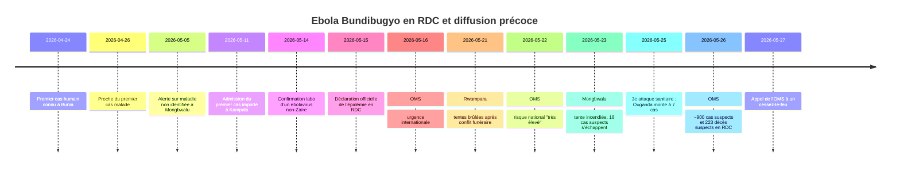
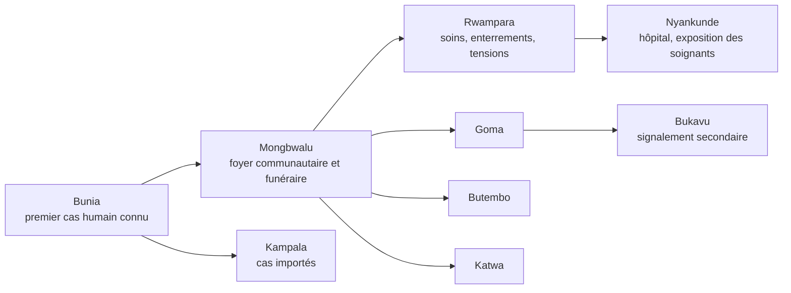

# Épidémie d’Ebola Bundibugyo en RDC jusqu’au 27 mai 2026

## Résumé exécutif

Au 27 mai 2026, la lecture la plus solide des sources publiques est la suivante : l’épidémie actuelle d’Ebola en RDC est causée par le virus Bundibugyo, une souche rare pour laquelle aucun vaccin ni traitement homologué n’est disponible à ce stade ; elle a été officiellement déclarée par les autorités congolaises le 15 mai, puis traitée par l’OMS comme une urgence de santé publique de portée internationale dans les jours suivants. Entre le 22 et le 27 mai, les chiffres ont fortement augmenté et restent instables selon les sources : l’OMS et plusieurs reprises médiatiques fiables parlent d’environ 750 cas suspects et 177 décès suspects au 22 mai, puis d’environ 900 cas suspects et 220 à 223 décès suspects au 26 mai ; l’Ouganda comptait alors 7 cas confirmés, dont 1 décès. AP ajoute au 27 mai que la RDC a dépassé les 100 cas confirmés, tout en restant proche de 1 000 cas suspects. citeturn32view1turn33view2turn29news1turn31news6turn31news4turn32view3

Sur la diffusion précoce, les sources convergent sur quatre moteurs principaux. D’abord, une circulation silencieuse durant plusieurs semaines avant la confirmation virologique. Ensuite, des funérailles à haut risque, avec manipulation des corps. Puis des déplacements de soins entre Mongbwalu, Rwampara et Bunia, auxquels s’ajoutent la mobilité minière et transfrontalière. Enfin, l’insécurité, la défiance communautaire et les attaques contre les structures de prise en charge, qui ont ralenti le traçage et favorisé la dispersion de cas suspects dans la communauté. Reuters rapporte qu’au moins une réunion de coordination montrait qu’à peine 7 % des 1 261 contacts identifiés avaient été effectivement suivis la semaine précédente, avant que l’OMS ne fasse état de plus de 2 000 contacts à suivre quelques jours plus tard. citeturn33view2turn32view0turn32view2turn33view0turn32view3turn33view4

Le point le plus important pour une dataviz est qu’il ne faut pas raconter cette flambée comme une simple diffusion linéaire depuis un unique “patient zéro” parfaitement identifié. Les sources montrent plutôt un faisceau d’indices : un premier cas humain connu à Bunia autour du 24 avril ; un foyer opérationnel très fort à Mongbwalu ; des passages par Rwampara et Bunia pour les soins ; une extension documentée vers Nyankunde, Goma, Butembo-Katwa, Bukavu selon certaines sources, puis Kampala en Ouganda. Il faut donc représenter une propagation par **réseaux de mobilité et de soins**, non par une seule flèche unique. fileciteturn0file1 fileciteturn0file0 citeturn33view2turn33view1turn32view5

Pour ton projet, la forme la plus viable est un **storytelling cartographique interactif sur une seule page**, articulé autour d’une carte MapLibre de la RDC orientale, d’une timeline filtrable, de fiches d’événements, et d’un panneau d’incertitude expliquant les divergences chiffrées. Cette approche est particulièrement adaptée parce que le cœur narratif de l’épidémie est spatial : trajets des malades, funérailles, centres de soins attaqués, zones minières, points-frontières, et extension vers Kampala. citeturn32view3turn33view0turn31news6

## Ce qui est établi au 27 mai

Le démarrage connu de l’épidémie est documenté autour du 24 avril 2026, mais avec une divergence importante sur la nature exacte de ce jalon. Le dossier de recherche que tu as fourni situe le **début des symptômes** du premier cas humain connu à Bunia le 24 avril, tandis qu’un papier Reuters du 22 mai parle du **décès du premier cas connu** à Bunia le 24 avril. Ces deux formulations ne sont pas incompatibles avec une maladie très brève, mais elles empêchent d’affirmer, au jour près, si le 24 avril correspond au début des symptômes ou au décès. En outre, l’OMS et d’autres sources ont ensuite indiqué que le virus avait probablement circulé depuis bien plus longtemps — plusieurs semaines, voire plusieurs mois selon certaines formulations — ce qui affaiblit l’idée d’un point de départ parfaitement borné au 24 avril. fileciteturn0file1 citeturn33view2turn32view4turn32view3

La propagation la plus plausible se lit en quatre temps. Un foyer initial ou au minimum un cluster très précoce est rattaché à la zone de Mongbwalu, dans une région aurifère très mobile. Des cas sont ensuite passés par Rwampara et Bunia pour y chercher des soins, ce qui a multiplié les occasions de transmission associée aux soins. Les enterrements et veillées ont ensuite joué un rôle central, les corps restant fortement infectieux après le décès. Enfin, la mobilité régionale a permis l’exportation de cas vers Kampala, tandis que des cas étaient rapportés en Ituri, au Nord-Kivu et, selon des sources secondaires crédibles, jusqu’au Sud-Kivu. fileciteturn0file0 citeturn33view2turn32view0turn32view5turn33view1turn31news6

L’insécurité et la défiance communautaire n’ont pas seulement compliqué la riposte : elles ont probablement accéléré la diffusion. Le 21 mai, des tentes de prise en charge ont été brûlées à Rwampara après un conflit autour d’une inhumation sécurisée. Le 23 mai, une autre tente a été incendiée à Mongbwalu et 18 cas suspects ont fui. Le 25 mai, AP décrivait une troisième attaque en une semaine contre des structures de santé. Dans le même temps, Reuters rapportait que l’épidémie “outpacing the response” et que la recherche des contacts était très en retard. Pour une dataviz, ces épisodes doivent être représentés comme des **ruptures de la capacité de contrôle**, pas comme de simples faits divers périphériques. citeturn32view0turn32view2turn33view0turn32view3

### Divergences chiffrées à suivre

| Date de référence | Source | Cas confirmés RDC | Cas suspects RDC | Décès suspects RDC | Ouganda | Lecture | Confiance |
|---|---|---:|---:|---:|---|---|---|
| 20 mai | Dossier de recherche fourni par l’utilisateur, synthétisant un sitrep INSP/COUSP | 51 | 575 | 148 | 2 cas confirmés | Très utile pour la structure spatiale, mais reste une compilation secondaire à revalider sur le sitrep original. fileciteturn0file1 | Medium |
| 22 mai | OMS reprise par Reuters | 82 | ~750 | 177 | 2 cas confirmés | Bon point d’appui pour la montée en charge nationale. citeturn32view1 | High |
| 25 mai | Ministère congolais relayé par AP | non harmonisé | 904 | 119 dans un message, mais 220 en additionnant les régions | 7 cas confirmés en Ouganda le même jour selon d’autres sources | Chiffres internes contradictoires ; à utiliser avec forte prudence. citeturn33view0turn33view1 | Low |
| 26 mai | OMS reprise par Le Guardian | non précisé | 900 | 223 | 7 cas confirmés, 1 décès | Bon ordre de grandeur pour la situation à la veille du 27 mai. citeturn29news1turn33view1 | High |
| 27 mai | Reuters / AP | “plus de 100” selon AP | 900 à presque 1 000 | 220 à 223 | 7 cas confirmés, 1 décès ; fermeture frontalière ougandaise annoncée | Le niveau de crise est clair ; l’exactitude des décès suspects varie encore selon la source et l’heure. citeturn31news6turn31news4turn29news1 | High sur la tendance, Medium sur le total exact |

## Chronologie jour par jour

Quand aucun jalon public daté n’a été retrouvé pour une journée précise, je le signale explicitement. Cela ne signifie pas qu’il ne s’est rien passé, mais que la documentation publique consultée ne permet pas de dater finement les événements de cette journée.

| Date | Fait principal | Confiance | Source |
|---|---|---|---|
| 24/04 | Premier cas humain connu à Bunia. Divergence : début des symptômes selon le dossier de recherche ; décès du premier cas connu selon Reuters. | Medium | fileciteturn0file1 citeturn33view2 |
| 25/04 | Aucun jalon public daté retrouvé ; début probable d’une fenêtre de transmission silencieuse. | Low |  |
| 26/04 | Une proche du premier cas tombe malade deux jours plus tard selon Jeune Afrique. | Medium | fileciteturn0file0 |
| 27/04 | Aucun jalon public daté retrouvé. | Low |  |
| 28/04 | Aucun jalon public daté retrouvé ; fin avril marquée par des décès précoces et des rites funéraires à risque. | Medium | fileciteturn0file0 |
| 29/04 | Aucun jalon public daté retrouvé. | Low |  |
| 30/04 | Aucun jalon public daté retrouvé ; fin avril, corps rapatrié vers Mongbwalu selon le récit médiatique fourni. | Medium | fileciteturn0file0 |
| 01/05 | Aucun jalon public daté retrouvé ; circulation non détectée probable. | Low |  |
| 02/05 | Aucun jalon public daté retrouvé. | Low |  |
| 03/05 | Aucun jalon public daté retrouvé. | Low |  |
| 04/05 | Aucun jalon public daté retrouvé. | Low |  |
| 05/05 | Première alerte connue reçue par l’OMS/les autorités sur une maladie non identifiée à Mongbwalu. | High | fileciteturn0file1 |
| 06/05 | Aucun jalon public daté retrouvé. | Low |  |
| 07/05 | Aucun jalon public daté retrouvé. | Low |  |
| 08/05 | Notification officielle de l’alerte évoquée dans le dossier de recherche. | High | fileciteturn0file1 |
| 09/05 | MSF indique avoir reçu durant le week-end des alertes sur une fièvre hémorragique présumée à Mongbwalu. | Medium | fileciteturn0file1 |
| 10/05 | Poursuite des premières évaluations de terrain à Mongbwalu. | Medium | fileciteturn0file1 |
| 11/05 | Réunion d’urgence en Ituri et admissions à Kampala du premier cas importé connu d’Ouganda. | High | fileciteturn0file1 fileciteturn0file0 |
| 12/05 | Investigations à Mongbwalu et Rwampara ; prélèvements envoyés pour confirmation. | High | fileciteturn0file1 |
| 13/05 | Aucune annonce publique majeure retrouvée, mais la phase d’investigation et de transport des échantillons se poursuit. | Medium | fileciteturn0file1 |
| 14/05 | Décès du patient importé à Kampala ; premières confirmations de laboratoire pour un ebolavirus non-Zaïre dans les échantillons analysés. | High | fileciteturn0file1 fileciteturn0file0 |
| 15/05 | Déclaration officielle de la 17e épidémie d’Ebola en RDC ; l’Ouganda confirme un cas importé. | High | fileciteturn0file1 citeturn17news1 |
| 16/05 | L’OMS considère la situation comme une urgence internationale ; les premiers chiffres internationaux consolidés circulent. | High | fileciteturn0file1 |
| 17/05 | Publication large de l’alerte internationale ; second cas importé confirmé en Ouganda selon les synthèses antérieures. | High | fileciteturn0file1 |
| 18/05 | Réunion de crise à Kinshasa selon Jeune Afrique ; confirmation du cas du Dr Peter Stafford à Nyankunde ; montée des alertes sur Goma. | Medium | fileciteturn0file0 |
| 19/05 | 513 cas suspects et 131 décès signalés dans des communications congolaises et reprises par la presse ; l’épidémie change clairement d’échelle. | Medium | fileciteturn0file0 citeturn17news3 |
| 20/05 | Point de situation intermédiaire : ~51 cas confirmés en RDC, ~575 à ~600 cas suspects, ~139 à ~148 décès suspects selon les sources. | High sur l’ordre de grandeur | fileciteturn0file1 citeturn32view4 |
| 21/05 | Incendie de tentes de prise en charge à Rwampara après une dispute autour d’une inhumation sécurisée. | High | citeturn32view0 |
| 22/05 | L’OMS relève le risque national pour la RDC à “très élevé” ; ~82 cas confirmés, ~750 cas suspects, 177 décès suspects ; l’Ituri interdit les veillées funéraires. | High | citeturn32view1turn33view2 |
| 23/05 | Tente MSF incendiée à Mongbwalu ; 18 cas suspects s’enfuient dans la communauté ; IFRC évoque 3 volontaires infectés possiblement dès le 27 mars. | High pour l’attaque, Medium pour l’indice de mars | citeturn32view2 |
| 24/05 | Tensions fortes autour des enterrements et de la défiance communautaire ; pas de nouveau bilan consolidé robuste retrouvé pour cette journée seule. | Medium | citeturn33view4 |
| 25/05 | Troisième attaque contre une structure de santé ; la communication congolaise fait état de 904 cas suspects, mais les décès publiés sont contradictoires ; l’Ouganda ajoute deux cas à Kampala, portant son total à 7. | Low pour les décès exacts, High pour les attaques et les 7 cas en Ouganda | citeturn33view0turn33view1 |
| 26/05 | L’OMS parle d’environ 900 cas suspects et 223 décès suspects en RDC ; 7 cas confirmés en Ouganda, dont 1 décès. | High | citeturn29news1turn33view1 |
| 27/05 | L’OMS appelle à un cessez-le-feu pour contenir l’épidémie ; AP parle de plus de 100 cas confirmés en RDC, de près de 1 000 cas suspects et d’au moins 220 décès ; l’Ouganda ferme sa frontière à l’essentiel du trafic seulement. | High sur la dynamique, Medium sur le décompte exact | citeturn31news4turn31news6turn29news1 |

La version “courte” de cette chronologie, adaptée à une visualisation, peut être résumée ainsi. fileciteturn0file1 citeturn32view1turn32view3turn31news6



## Carte des lieux et logique de diffusion

La meilleure lecture cartographique n’est pas “Bunia puis tout le reste”, ni “Mongbwalu puis tout le reste”, mais un système de lieux interdépendants. Bunia apparaît comme le premier lieu documenté pour le premier cas humain connu ; Mongbwalu comme le principal foyer communautaire et funéraire précoce ; Rwampara comme un espace critique de soins et de tensions autour des enterrements ; Nyankunde comme point important via l’hôpital et le cas du médecin missionnaire américain ; Goma, Butembo-Katwa et probablement Bukavu comme signes d’extension vers des pôles urbains plus denses ; Kampala comme preuve de diffusion transfrontalière. fileciteturn0file0 citeturn33view2turn33view1turn32view5turn31news6

### Coordonnées de travail pour la carte

Ces coordonnées doivent être considérées comme des **centroïdes de travail** pour la dataviz, pas comme des localisations opérationnelles parfaites. Pour Rwampara et Nyankunde, la précision publique consultable est insuffisante ; je recommande d’utiliser ensuite un fond SIG officiel de zones de santé ou des shapefiles humanitaires pour remplacer ces points provisoires.

| Lieu | Latitude | Longitude | Type de point | Précision | Source |
|---|---:|---:|---|---|---|
| Bunia | 1.5667 | 30.2500 | ville / chef-lieu | High | citeturn24search3 |
| Mongbwalu | 1.94468 | 30.03861 | ville minière | High | citeturn18search0 |
| Rwampara | 1.5667 | 30.2500 | proxy Bunia–Rwampara / camp Rwampara | Low | citeturn22search5turn22search4 |
| Nyankunde | 1.2810 | 29.9640 | point **approximatif inféré** depuis “45 km au sud-ouest de Bunia” | Low | citeturn25search1turn25search3 |
| Goma | -1.693314 | 29.245241 | ville | High | citeturn27search4 |
| Katwa | 0.116513 | 29.371825 | commune / quartier de Butembo | High | citeturn19search5 |
| Butembo | 0.127752 | 29.287371 | ville | High | citeturn19search3 |
| Bukavu | -2.5167 | 28.8500 | ville | High | citeturn20search5 |
| Kampala | 0.315278 | 32.568611 | centre-ville proxy | Medium | citeturn26search1 |
| Aru | 2.861948 | 30.83124 | ville / point-frontière régional | High | citeturn21search1 |
| Fataki | 2.022030 | 30.564297 | localité mentionnée dans les sources secondaires | Medium | citeturn21search2 |
| Tchomia | à consolider | à consolider | port lacustre important | Low | citeturn21search4turn22search4 |

### Schéma simple des flux

Ce schéma résume la logique de diffusion la plus prudente à raconter dans la carte. fileciteturn0file0 citeturn33view2turn32view5turn33view1turn31news6



## Modèle de données pour la dataviz

Le plus robuste est de séparer les données en quatre tables principales : `places`, `events`, `flows`, `zone_counts`. Il faut aussi conserver deux colonnes transversales partout : `confidence` et `source_ref`. Sans cela, la visualisation masque les divergences au lieu de les expliquer.

### Schéma conseillé

**`places.csv`**

```csv
place_id,name,admin1,country,lat,lon,geo_precision,place_type,notes
bunia,Bunia,Ituri,RDC,1.5667,30.2500,city_centroid,city,Chef-lieu provincial
mongbwalu,Mongbwalu,Ituri,RDC,1.94468,30.03861,city_centroid,mining_town,Foyer précoce
rwampara,Rwampara,Ituri,RDC,1.5667,30.2500,proxy,health_zone_proxy,À remplacer par un polygone officiel
nyankunde,Nyankunde,Ituri,RDC,1.2810,29.9640,approx_inferred,health_zone_proxy,Approximation depuis Bunia
goma,Goma,Nord-Kivu,RDC,-1.693314,29.245241,city_centroid,city,Extension urbaine
katwa,Katwa,Nord-Kivu,RDC,0.116513,29.371825,commune_centroid,commune,Commune de Butembo
butembo,Butembo,Nord-Kivu,RDC,0.127752,29.287371,city_centroid,city,Extension urbaine
kampala,Kampala,Central,Uganda,0.315278,32.568611,city_centre_proxy,city,Importation transfrontalière
```

**`events.csv`**

```csv
event_id,event_date,event_type,place_id,title,description,cases_confirmed,cases_suspected,deaths_suspected,contacts,confidence,source_ref
ev_20260424_bunia,2026-04-24,first_known_case,bunia,Premier cas humain connu,Début des symptômes ou décès du premier cas connu selon les sources,, , , ,medium,"turn0file1|turn33view2"
ev_20260505_mongbwalu,2026-05-05,alert,mongbwalu,Première alerte connue,Alerte sur une maladie inconnue à forte létalité,,,,,high,"turn0file1"
ev_20260515_drc,2026-05-15,declaration,bunia,Déclaration officielle de l'épidémie,17e épidémie d'Ebola déclarée en RDC,8,246,80,65,high,"turn0file1"
ev_20260521_rwampara,2026-05-21,attack,rwampara,Tentes incendiées à Rwampara,Incendie après dispute autour d'une inhumation sécurisée,,,,,high,"turn32view0"
ev_20260523_mongbwalu,2026-05-23,attack,mongbwalu,Tente incendiée à Mongbwalu,18 cas suspects s'échappent dans la communauté,,18,,,high,"turn32view2"
ev_20260527_drc,2026-05-27,update,bunia,Point de situation au 27 mai,OMS et agences : ~900 cas suspects et 220-223 décès suspects en RDC,,900,223,,high,"turn31news4|turn29news1"
```

**`flows.csv`**

```csv
flow_id,start_date,from_place_id,to_place_id,flow_type,status,weight,confidence,source_ref,notes
fl_funeral_01,2026-04-24,bunia,mongbwalu,body_transfer,documented,1,medium,"turn33view2|turn0file0","Rapatriement du corps et rites funéraires"
fl_care_01,2026-05-01,mongbwalu,rwampara,care_seeking,probable,3,medium,"turn0file1","Malades allant chercher des soins"
fl_care_02,2026-05-01,mongbwalu,bunia,care_seeking,probable,3,medium,"turn0file1","Déplacements vers Bunia"
fl_crossborder_01,2026-05-11,bunia,kampala,imported_case,documented,1,high,"turn0file1|turn31news6","Premier cas importé connu"
```

**`zone_counts.csv`**

```csv
report_date,zone_id,confirmed,suspected,suspected_deaths,contacts,confidence,source_ref
2026-05-20,drc_total,51,575,148,847,medium,"turn0file1"
2026-05-22,drc_total,82,750,177,,high,"turn32view1"
2026-05-26,drc_total,,900,223,,high,"turn29news1"
2026-05-27,uganda_total,7,,1,,high,"turn31news6"
```

### Exemple JSON minimal exploitable

L’exemple ci-dessous est volontairement simple, mais déjà compatible avec un front MapLibre + D3. Les événements sont **mockés au format final**, tout en restant rattachés à des faits réellement documentés. fileciteturn0file1 citeturn32view0turn32view2turn31news6turn29news1

```json
{
  "places": [
    {"id": "bunia", "name": "Bunia", "lat": 1.5667, "lon": 30.25, "geo_precision": "city_centroid"},
    {"id": "mongbwalu", "name": "Mongbwalu", "lat": 1.94468, "lon": 30.03861, "geo_precision": "city_centroid"},
    {"id": "kampala", "name": "Kampala", "lat": 0.315278, "lon": 32.568611, "geo_precision": "city_centre_proxy"}
  ],
  "events": [
    {
      "id": "ev_20260424_bunia",
      "date": "2026-04-24",
      "place_id": "bunia",
      "type": "first_known_case",
      "title": "Premier cas humain connu",
      "confidence": "medium",
      "source_ref": ["turn0file1", "turn33view2"]
    },
    {
      "id": "ev_20260521_rwampara",
      "date": "2026-05-21",
      "place_id": "rwampara",
      "type": "attack",
      "title": "Centre de prise en charge incendié",
      "confidence": "high",
      "source_ref": ["turn32view0"]
    },
    {
      "id": "ev_20260523_mongbwalu",
      "date": "2026-05-23",
      "place_id": "mongbwalu",
      "type": "attack_escape",
      "title": "18 cas suspects s'échappent",
      "confidence": "high",
      "source_ref": ["turn32view2"]
    }
  ],
  "flows": [
    {
      "id": "fl_bunia_mongbwalu_funeral",
      "from": "bunia",
      "to": "mongbwalu",
      "date": "2026-04-24",
      "type": "funeral_related",
      "confidence": "medium",
      "source_ref": ["turn33view2", "turn0file0"]
    },
    {
      "id": "fl_bunia_kampala_import",
      "from": "bunia",
      "to": "kampala",
      "date": "2026-05-11",
      "type": "cross_border_case",
      "confidence": "high",
      "source_ref": ["turn0file1", "turn31news6"]
    }
  ]
}
```

## Articles récents et veille priorisée

### Tableau comparatif des articles récents

| Date | Titre | Média | Langue | Accès | Résumé | Fiabilité | Lien |
|---|---|---|---|---|---|---|---|
| 27/05 | *WHO urges ceasefire in Congo to contain Ebola as cases surge* | Reuters | EN | libre | Mise à jour sur l’appel de l’OMS à un cessez-le-feu et sur l’ampleur nationale de la flambée. | Très élevée | citeturn31news4 |
| 27/05 | *‘Breakneck’ Ebola epidemic in Congo outpaces world’s response* | Reuters | EN | libre | Donne des détails très utiles sur le traçage des contacts, les failles de réponse et les contraintes logistiques. | Très élevée | citeturn31news3 |
| 27/05 | *Uganda closes its border with Congo as cases of a rare Ebola type surge* | AP | EN | libre | Très utile pour le versant transfrontalier, le total ougandais et la fermeture de frontière. | Très élevée | citeturn31news6 |
| 25/05 | *Spread of Ebola in DRC ‘outpacing’ response efforts, warns WHO* | The Guardian | EN | libre | Bonne synthèse de la montée des cas et des nouveaux foyers, y compris Kampala et le Nord-Kivu. | Élevée | citeturn33view1 |
| 23/05 | *A second Ebola treatment center is set ablaze in eastern Congo, with 18 suspected cases fleeing* | AP | EN | libre | pièce centrale pour représenter l’impact des attaques contre les structures de santé. | Très élevée | citeturn32view2 |
| 21/05 | *Congo protesters set fire to Ebola treatment tents in dispute over victim’s body* | Reuters | EN | libre | Documente le rôle des enterrements et des refus d’inhumation sécurisée dans la propagation. | Très élevée | citeturn32view0 |
| 22/05 | *Ebola in the DRC: “The epidemic is unprecedented in scale”* | Le Monde | FR/EN | paywall partiel | Très instructif sur l’ampleur, l’insécurité, la logistique et l’indice d’une circulation plus ancienne. | Élevée | citeturn32view4 |
| 23/05 | *New Ebola outbreak in the DR Congo puts international solidarity to the test* | Le Monde | FR/EN | paywall partiel | Replace l’épidémie dans le contexte structurel : aide internationale, surveillance, zoonoses. | Élevée | citeturn17news1 |
| 19/05 | *« Ebola ne respecte pas les frontières » : en RDC, une souche inédite du virus complique la riposte sanitaire* | Jeune Afrique | FR | paywall habituel, PDF fourni par toi | Très utile pour les détails précoces : Bunia, Mongbwalu, Nyankunde, Goma, travail des autorités et insécurité. | Élevée mais secondaire | fileciteturn0file0 |
| 27/05 | *“Some Congolese believe Westerners created this disease”* | Le Monde | FR/EN | paywall partiel | Excellente source pour la défiance communautaire, la désinformation et les attaques de terrain. | Élevée | citeturn33view4 |

### Liste priorisée de sources pour suivi continu

La hiérarchie la plus utile pour ton projet est la suivante.

D’abord, les **sources institutionnelles congolaises** : ministère de la Santé, INSP/COUSP-RDC et INRB. Ce sont elles qu’il faut privilégier pour les line-lists, la nomenclature des zones de santé, les sitreps et les décisions officielles. Ton dossier de recherche fourni montre déjà à quel point ces documents sont structurants pour la chronologie et les répartitions spatiales, même s’ils exigent ensuite une harmonisation attentive. fileciteturn0file1

Ensuite, l’**OMS** et **Africa CDC**. L’OMS sert de point de référence pour les évaluations de risque, la qualification d’urgence internationale, les bilans consolidés et les recommandations transfrontalières. Africa CDC, même quand ses chiffres provisoires divergent, apporte une lecture régionale et opérationnelle très utile sur la dynamique de réponse. citeturn32view1turn32view3turn33view2

En troisième rang, le **ministère de la Santé ougandais**, car Kampala est devenu un révélateur central de la diffusion précoce. Dans les sources consultées ici, les meilleurs points d’entrée ont surtout été AP, Reuters et Le Guardian ; il faudra, pour la veille de production, reconnecter autant que possible les communiqués primaires ougandais eux-mêmes. citeturn31news6turn33view1

En quatrième rang, les **ONG de terrain** : MSF, ALIMA, IFRC, IRC, Save the Children. Elles documentent mieux que les institutions centrales certaines ruptures de terrain : incendies de tentes, fuites de cas suspects, besoins logistiques, défiance et déficit d’équipements. citeturn32view2turn33view4turn31news4

En cinquième rang, la **presse de référence**. Reuters et AP sont les plus utiles pour la granularité factuelle quotidienne ; Le Monde apporte de très bonnes synthèses analytiques ; Jeune Afrique est utile, mais souvent paywall. Pour un usage éditorial permanent, il faut les employer comme un système d’alerte et de recoupement, pas comme source finale unique. citeturn31news4turn31news6turn32view4turn17news1 fileciteturn0file0

Enfin, pour la veille scientifique, je recommande de suivre **virological.org**, **medRxiv/bioRxiv**, les dépôts de séquences et les rapports de modélisation rapide. Dans les sources consultées ici, le signal le plus concret est un rapport de modélisation d’Imperial College London cité par *Le Monde* ; je n’ai pas identifié, dans cette recherche, un corpus robuste de preprints déjà stabilisé sur cette flambée au 27 mai. citeturn17news2

## Recommandations de collecte et de visualisation

Pour la collecte automatisée, je te conseille un pipeline à trois vitesses.

La première vitesse doit viser les **sources officielles HTML/PDF** : OMS, Africa CDC, ministère congolais, INSP/COUSP, INRB, ministère ougandais. Fréquence recommandée : toutes les 30 à 60 minutes en période chaude, avec détection de changement par hash, `ETag` ou `Last-Modified`, archivage des PDFs, et extraction structurée des dates, lieux, catégories de cas et décisions. Ici, il vaut mieux faire du polling propre et parcimonieux que du scraping agressif. citeturn32view1turn32view3

La deuxième vitesse doit viser les **médias de référence**. Pour Reuters et AP, le meilleur cadre légal reste une licence ou un accès institutionnel. Pour les titres disposant de flux de syndication, l’usage RSS est préférable. On sait au moins, d’après la documentation de *Le Monde*, que ses flux RSS existent mais sont limités à un usage personnel, non professionnel et non collectif sans autorisation. Autrement dit : pour un projet éditorial ou produit, il faut vérifier précisément les conditions de réutilisation. citeturn36news2

La troisième vitesse doit viser les **documents analytiques et techniques** : rapports de modélisation, notes ONG, dépôts de séquences quand ils existent, et compilations comme ton dossier de recherche. Fréquence recommandée : toutes les 6 à 12 heures, car ces sources changent moins vite, mais peuvent modifier fortement l’interprétation en apportant une nouvelle carte, un nouveau rapport de contact tracing ou une hypothèse génomique plus solide. fileciteturn0file1 citeturn17news2turn32view3

Sur la dataviz elle-même, la forme la plus efficace serait une **page unique scrollytelling** composée de quatre blocs synchronisés : une carte principale MapLibre, une timeline horizontale D3, un panneau “faits du jour”, et un encart “incertitudes / divergences”. La carte doit pouvoir afficher les lieux, les flux, les attaques contre les structures de santé, les points-frontières et l’extension régionale. La timeline doit permettre de rejouer la période du 24 avril au 27 mai en filtrant les couches de la carte. Le panneau texte doit raconter l’histoire au fur et à mesure, avec citations et niveau de confiance. Enfin, l’encart d’incertitude doit expliquer pourquoi un même jour peut afficher 119, 220 ou 223 décès suspects selon la source et l’heure. Cette pédagogie de l’incertitude est capitale ici. citeturn33view0turn29news1turn31news4

Un socle technique simple pourrait être : MapLibre pour le fond de carte et les points/flux, D3 pour la timeline et les graphes annexes, et un front léger en SvelteKit ou React. Le style visuel doit distinguer clairement trois statuts : **confirmé**, **suspect**, **signal secondaire non harmonisé**. Les flux avérés peuvent être en trait plein ; les flux probables ou reconstruits en pointillé ; les coordonnées approximatives avec un halo flou. Il faut aussi prévoir un mode “expert” qui affiche les citations et un mode “lecture” plus épuré.

```js
const map = new maplibregl.Map({
  container: "map",
  style: "https://demotiles.maplibre.org/style.json",
  center: [30.25, 1.57],
  zoom: 6
});

// places GeoJSON
map.addSource("places", { type: "geojson", data: placesGeojson });
map.addLayer({
  id: "places-circles",
  type: "circle",
  source: "places",
  paint: {
    "circle-radius": ["match", ["get", "confidence"], "high", 8, "medium", 6, 5]
  }
});

// flows GeoJSON
map.addSource("flows", { type: "geojson", data: flowsGeojson });
map.addLayer({
  id: "flows-lines",
  type: "line",
  source: "flows",
  paint: {
    "line-width": ["interpolate", ["linear"], ["get", "weight"], 1, 1.5, 10, 6]
  }
});

// filtre temporel
function setDateFilter(currentDate) {
  map.setFilter("places-circles", ["<=", ["get", "event_date"], currentDate]);
  map.setFilter("flows-lines", ["<=", ["get", "start_date"], currentDate]);
}
```

D’un point de vue éditorial et sécuritaire, trois règles me paraissent non négociables. D’abord, ne jamais cartographier des résidences de cas, des itinéraires individuels fins ou des contacts identifiables. Ensuite, ne jamais afficher comme certain un “patient zéro” que les sources ne stabilisent pas. Enfin, éviter de publier des localisations trop précises pour des dispositifs temporaires, des centres d’isolement improvisés ou des points sensibles dans un contexte d’attaques contre les soignants. Les structures de santé ont déjà été incendiées à Rwampara et Mongbwalu ; il faut donc préférer des points agrégés ou des polygones de zone à des coordonnées hyperlocales quand l’usage éditorial ne l’exige pas absolument. citeturn32view0turn32view2turn33view0turn33view4

## Questions ouvertes et limites

La première limite, c’est l’origine exacte. Les sources disponibles ne permettent pas de nommer avec certitude le véritable cas index ni la date réelle du spillover zoonotique. Certaines sources parlent d’un premier cas humain connu le 24 avril ; d’autres laissent entendre une circulation antérieure de plusieurs semaines ou mois, voire des expositions possibles dès fin mars. citeturn33view2turn32view4turn32view3

La deuxième limite, c’est l’harmonisation des chiffres. Les écarts entre 119, 220 et 223 décès suspects ne sont pas des détails ; ils montrent que certaines communications additionnent différemment les niveaux géographiques ou mélangent états de validation distincts. Il faut donc, dans la dataviz, afficher la **source**, l’**horodatage** et la **catégorie exacte** de chaque chiffre. citeturn33view0turn29news1turn31news4

La troisième limite, c’est la géographie opérationnelle. Les coordonnées exactes des zones de santé et des aires de santé, notamment Rwampara et Nyankunde dans les sources grand public, restent insuffisamment propres pour une publication cartographique rigoureuse. Les points proposés ici sont bons pour un prototype, mais la version finale devra intégrer des limites administratives et sanitaires plus fiables. citeturn22search5turn25search1turn25search3

Pour suivre les développements les plus récents sur cette flambée :

navlistCouverture récente de l’épidémie Bundibugyo en RDC et en Ougandaturn31news4,turn31news3,turn31news6,turn31news10,turn31news8,turn31news7,turn17news0,turn17news1